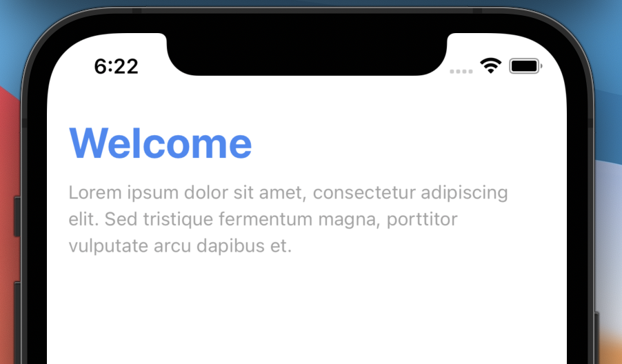
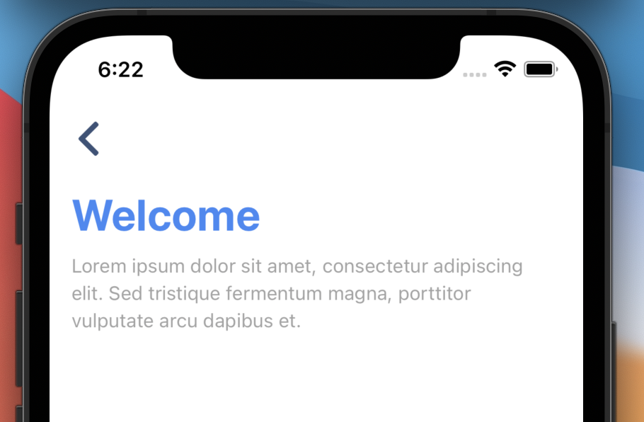

[](https://github.com/WrathChaos/react-native-elegant-header)

[](https://github.com/WrathChaos/react-native-elegant-header)

[](https://www.npmjs.com/package/react-native-elegant-header)
[](https://www.npmjs.com/package/react-native-elegant-header)

[](https://opensource.org/licenses/MIT)
[](https://github.com/prettier/prettier)

<table>
  <tr>
    <td align="center">
      
    </td>
    <td align="center">
      
    </td>
   </tr>
</table>

# Installation

Add the dependency:

```bash
npm i react-native-elegant-header
```

## Peer Dependencies

<h5><i>Zero Dependency</i></h5>

# Usage

## Import

```jsx
import ElegantHeader from "react-native-elegant-header";
```

## Fundamental Usage

```jsx
<ElegantHeader
  title="Welcome"
  description="Lorem ipsum dolor sit amet, consectetur adipiscing elit. Sed tristique fermentum magna, porttitor vulputate arcu dapibus et."
/>
```

## Basic Usage with Back Button

```jsx
<ElegantHeader
  title="Welcome"
  description="Lorem ipsum dolor sit amet, consectetur adipiscing elit. Sed tristique fermentum magna, porttitor vulputate arcu dapibus et."
  enableBackButton
  onPress={() => {}}
/>
```

## Example Project 😍

You can checkout the example project 🥰

Simply run

- `npm i`
- `react-native run-ios/android`

should work of the example project.

# Configuration - Props

## Fundamentals

| Property    |  Type  |  Default  | Description           |
| ----------- | :----: | :-------: | --------------------- |
| title       | string | undefined | change the title      |
| description | string | undefined | change the descrition |

## Customization (Optionals)

| Property                  |   Type    |  Default  | Description                                                             |
| ------------------------- | :-------: | :-------: | ----------------------------------------------------------------------- |
| enableBackButton          |  boolean  |   false   | let you enable the back button (must use it for button)                 |
| onPress                   | function  | undefined | set your own logic for the back button functionality when it is pressed |
| TextComponent             |   Text    |  default  | set your own component instead of default react-native Text component   |
| TouchableComponent        |   Image   |  default  | set your own component instead of default react-native Image component  |
| style                     | ViewStyle |  default  | set or override the style object for the main container                 |
| backButtonImageStyle      | ViewStyle |  default  | set or override the style object for the back button's image style      |
| titleTextStyle            | TextStyle |  default  | set or override the style object for the title's text style             |
| descriptionTextStyle      | TextStyle |  default  | set or override the style object for the description's text style       |
| descriptionContainerStyle | ViewStyle |  default  | set or override the style object for the description's container style  |

## Future Plans

- [x] ~~LICENSE~~
- [ ] Write an article about the lib on Medium

# Change Log

Change log will be here !

## Author

FreakyCoder, kurayogun@gmail.com

## License

React Native Elegant Header is available under the MIT license. See the LICENSE file for more info.

```

```
